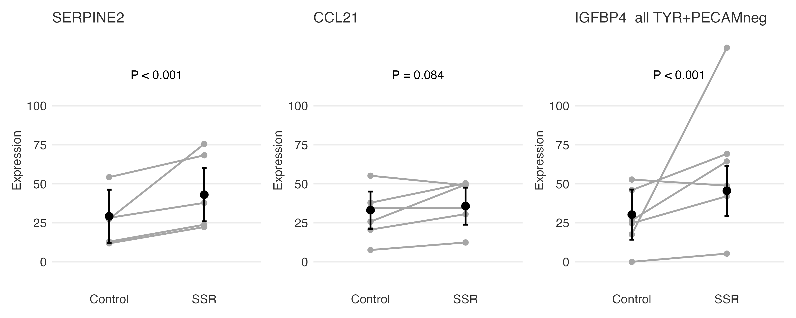

```{r}
#| label: setup
#| include: false
library(here)

```

## The collaboration


\
 
::::: columns
::: {.column width="55%"}

I have a long-term working relationship with the **OHSU Department of Dermatology**.

\

This project came out of that relationship:

::: {.callout-note icon="false"}
### The scientific question
Does exposure to **simulated solar radiation (SSR)** change the expression of specific RNA markers in human melanocytic nevi (moles)?

Nevi are benign melanocyte clusters — and a key focus of melanoma prevention research.
:::

\

My role: **statistical collaborator**. I didn't design the experiment or collect the tissue — I was brought in to figure out how to analyze it correctly.

:::

::: {.column width="45%"}

::: {.callout-tip icon="false"}
### Why this matters to you

This is what collaboration looks like in practice.

\

The researchers had a biologically important question and a carefully designed experiment. They needed someone who could:

- Understand the data structure
- Choose the right model
- Communicate the results clearly

**That's the role this course prepares you to play — or to seek out.**
:::

:::
:::::

## The study design

\

::::: columns
::: {.column width="55%"}

**6 volunteers**, each contributing **2 nevi**:

- One nevus received SSR (the irradiated condition)
- One nevus served as an unirradiated control
- Both nevi from the same person were matched for size, location, and clinical appearance

\

The tissue was excised by punch biopsy and analyzed using **single-nucleus RNA sequencing (snRNAseq)** — a technique that measures gene expression at the level of individual cell nuclei.

\

Three RNA markers were of primary interest:

- **SERPINE2** — a melanoma-associated serine protease inhibitor
- **CCL21** — a marker of lymphatic endothelial activation
- **IGFBP4** — a modulator of the IGF-1 signaling axis

:::

::: {.column width="45%"}

::: {.callout-important icon="false"}
### Spot the design

Does this remind you of anything from the course?

\

Each patient contributes **one irradiated nevus** and **one control nevus**.

\

The patient is their own control. The natural comparison is **within-person** — exactly the logic of the **paired t-test**.

:::

:::
:::::

## The data structure problem

\

Here's where the paired t-test breaks down — and where a new tool is needed.

\

::::: columns
::: {.column width="55%"}

A paired t-test requires **one summary value per person per condition** — a single difference per pair.

\

But snRNAseq doesn't give you one number per sample. It gives you **hundreds of individual cell-nucleus measurements** per sample.

\

For each patient, for each RNA, for each condition, we have a **distribution of expression values** — one per nucleus captured.

:::

::: {.column width="45%"}

::: {.callout-note icon="false"}
### The data structure

```
ptid | condition | RNA     | value
-----|-----------|---------|------
001  | Control   | SERPINE2| 12.3
001  | Control   | SERPINE2| 8.7
001  | Control   | SERPINE2| 15.1
...  | ...       | ...     | ...
001  | SSR       | SERPINE2| 24.6
001  | SSR       | SERPINE2| 19.2
...
002  | Control   | SERPINE2| 10.4
...
```

Hundreds of rows per patient per condition. All observations within a patient are **correlated**.

:::

:::
:::::

## The model

\

The solution is the **linear mixed model** — exactly what we introduced in the animal studies section. The key idea: give each patient **their own baseline**.

::::: columns
::: {.column width="55%"}

In R:

::: {style="font-size: 0.75em;"}
```r
library(lme4)

model <- lmer(
  value ~ tx + (1 | ptid),
  data = rna_data
)
```
:::

::: {.callout-note icon="false"}
### What each piece does
- `tx` — fixed effect for treatment (SSR vs. Control): the effect we care about
- `(1 | ptid)` — random intercept for patient: each person gets their own baseline, absorbing the within-patient correlation
- Estimates the treatment effect **within patients**, not just across group averages
:::

:::

::: {.column width="45%"}

::: {.callout-tip icon="false"}
### Connection to the paired t-test
The random intercept does conceptually what the paired t-test does — it removes between-person variability so the treatment effect comes from **within-person differences**.

The mixed model generalizes this to settings where you have many measurements per person, not just one.
:::

:::
:::::

## The model

\

The solution is the **linear mixed model** — exactly what we introduced in the animal studies section.


$$\text{Expression}_{ij} = \beta_0 + \beta_1 \cdot \text{SSR}_i + b_j + \varepsilon_{ij}$$


::::: columns
::: {.column width="55%"}

In R:

::: {style="font-size: 0.75em;"}

```r
library(lme4)

model <- lmer(
  value ~ tx + (1 | ptid),
  data = rna_data
)
```
:::

::: {.callout-note icon="false"}
### What each piece does
- `tx` — fixed effect for treatment (SSR vs. Control): the effect we care about
- `(1 | ptid)` — random intercept for patient: each person gets their own baseline, absorbing the within-patient correlation
- This estimates the treatment effect **within patients**, not just across group averages
:::

:::

::: {.column width="45%"}


\

\

\


::: {.callout-tip icon="false"}
### Connection to the paired t-test

The random intercept for patient does conceptually what the paired t-test does — it removes between-person variability so the treatment effect is estimated from **within-person differences**.

The mixed model generalizes this to settings where you have many measurements per person, not just one.
:::

:::
:::::


## The results


{fig-align="center" width="100%"}


::: {.callout-note icon="false"}
### What to look for
*Each gray line is one patient. Black points and error bars are model-estimated marginal means ± 95% CI. p-values from the linear mixed model.*

The gray lines tell the within-patient story. When most lines slope in the **same direction**, the within-patient signal is strong — and 
that's what the mixed model is detecting. It's possible for the group-level confidence intervals to **overlap** while the within-patient 
effect is still statistically significant, because the model uses the paired structure directly. Notice also that CCL21 shows a trend 
(p = 0.084) but not a significant result — not every marker responds the same way, and the model reflects that honestly.
:::


## What I learned from this collaboration

\

::::: columns
::: {.column width="48%"}

**Statistically:**

- The biology determined the model. The paired design was built in — my job was to recognize it in the data structure and use a model that respected it.
- Mean-centering within patients (a sensitivity analysis) confirmed the results weren't driven by between-patient baseline differences. The findings held.
- Communicating "why the group CIs can overlap but the test is still significant" to non-statisticians is one of the hardest and most important things we do.

:::

::: {.column width="5%"}

:::

::: {.column width="47%"}

**About collaboration:**

::: {.callout-tip icon="false"}
The researchers knew their biology deeply. They knew what nevi are, what SSR does to DNA, why these three RNA markers matter for melanoma prevention.

I knew the data structure and what model to use.

Neither of us could have done the other's job. That's what makes it a real collaboration — and why the conversations you'll have with statisticians matter. **You bring the biology. We bring the model.**
:::

:::
:::::
